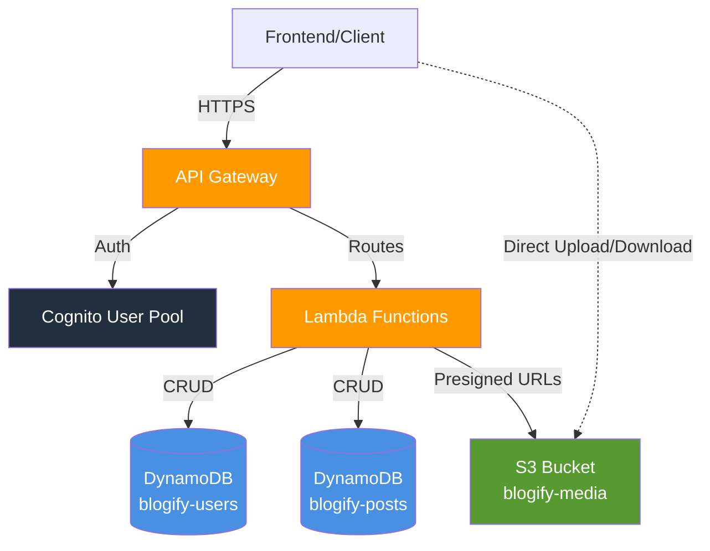

# Blogify - Headless Blogging Platform

Serverless blogging platform built with AWS Lambda, DynamoDB, S3, and Cognito.


## Features

- User authentication with AWS Cognito
- Full CRUD operations for blog posts
- Media management via S3 presigned URLs
- Role-based access control (Admin, Editor, Guest Author)

## Prerequisites

- Node.js 20.x+
- Yarn
- AWS CLI configured
- Serverless Framework: `yarn global add serverless`

## Quick Start

```bash
# Install dependencies
yarn install

# Run backend locally
yarn dev:functions  # API at http://localhost:3000

# Run frontend locally
yarn dev:frontend  # Frontend at http://localhost:4000
```

**Frontend local API**: Create `frontend/.env.local` with `NEXT_PUBLIC_API_URL=http://localhost:3000/dev`

## Deployment

```bash
yarn deploy:functions:dev   # Deploy to dev stage
yarn deploy:functions:prod  # Deploy to production
```

## API Documentation

```bash
cd functions && yarn docs:generate  # Generate openapi.yml
cd functions && yarn docs:serve     # View in Swagger UI
```

## Project Documentation

```bash
yarn dev:docs    # Start Docusaurus docs server
yarn build:docs  # Build documentation
```

Full documentation is available in the `documentation/` folder.

## Project Structure

```
├── functions/        # Serverless functions (Lambda handlers)
├── frontend/         # Next.js frontend
└── package.json      # Root workspace config
```

## AWS Architecture

The platform follows a serverless architecture pattern, where all components scale automatically and you only pay for what you use. Requests flow through API Gateway, which validates authentication via Cognito before routing to Lambda functions. Lambda functions interact with DynamoDB for structured data and generate presigned URLs for S3 media operations.



**Components:**

- **API Gateway** - REST API endpoint with Cognito authorizers for protected routes
- **Cognito User Pool** - User authentication and authorization (email-based, password policies)
- **Lambda Functions** - Serverless handlers for auth, posts, and media operations
- **DynamoDB Tables** - `blogify-users-{stage}` (user metadata/roles), `blogify-posts-{stage}` (blog content with GSI on authorId)
- **S3 Bucket** - `blogify-media-{stage}` - Media storage with CORS enabled for direct client uploads/downloads
