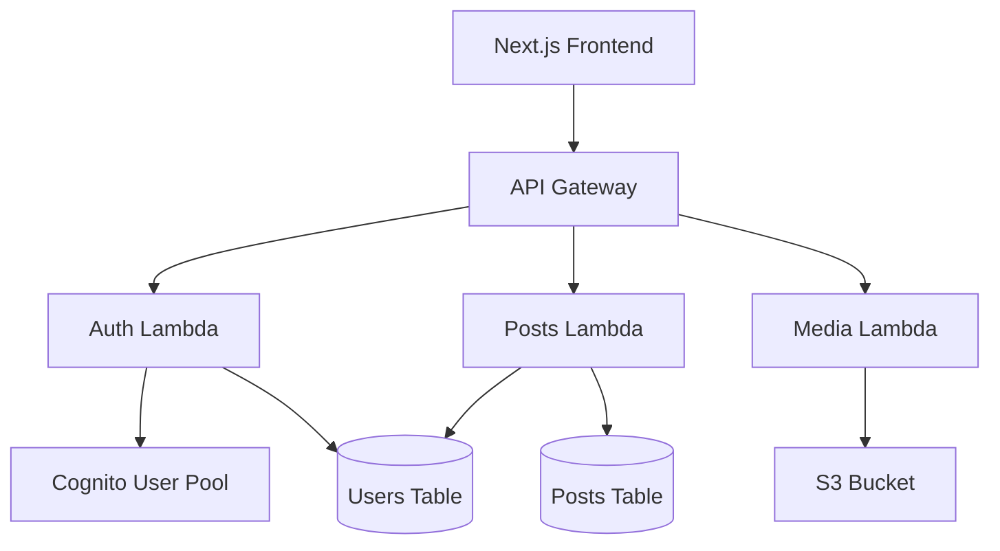
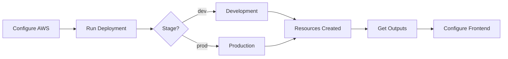

# Deployment Guide

This guide walks you through deploying Blogify to AWS.

## Architecture Overview



## Prerequisites

- AWS Account with appropriate permissions
- AWS CLI configured: `aws configure`
- Serverless Framework installed: `yarn global add serverless`

## Environment Setup

1. **Configure AWS Credentials**

```bash
aws configure
```

2. **Set Environment Variables** (optional)

Create a `.env` file in the `functions` directory if needed.

## Deployment Steps



### Deploy to Development

```bash
yarn deploy:functions:dev
```

This will:

- Create/update DynamoDB tables
- Create/update S3 bucket
- Create/update Cognito User Pool
- Deploy Lambda functions
- Configure API Gateway

### Deploy to Production

```bash
yarn deploy:functions:prod
```

**⚠️ Warning**: Production deployment will use the `prod` stage. Make sure you're ready before deploying.

## Post-Deployment

After deployment, note the following outputs:

- **API Gateway URL**: Available in the deployment output
- **User Pool ID**: For frontend configuration
- **User Pool Client ID**: For frontend configuration
- **S3 Bucket Name**: For media storage

## Frontend Configuration

Update your frontend `.env.production`:

```env
NEXT_PUBLIC_API_URL=https://your-api-id.execute-api.region.amazonaws.com/prod
NEXT_PUBLIC_USER_POOL_ID=your-user-pool-id
NEXT_PUBLIC_USER_POOL_CLIENT_ID=your-client-id
```

## Troubleshooting

### Common Issues

1. **Permission Errors**: Ensure your AWS credentials have necessary permissions
2. **Resource Conflicts**: Delete existing resources if redeploying
3. **CORS Issues**: Check API Gateway CORS configuration

## Cleaning Up

To remove all deployed resources:

```bash
cd functions
serverless remove --stage dev
```
