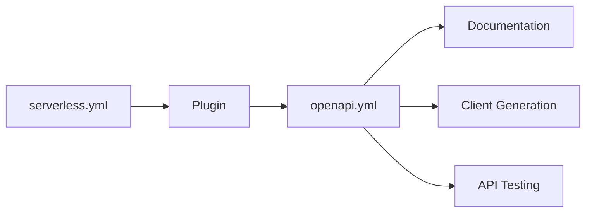

# OpenAPI Specification Guide

This guide explains how Blogify generates and uses OpenAPI specifications for API documentation.

## What is OpenAPI?

OpenAPI (formerly Swagger) is a specification for describing REST APIs. It provides a standard format to document your API endpoints, request/response schemas, and authentication methods.

## How It Works



Blogify uses the `serverless-openapi-documentation` plugin to automatically generate OpenAPI specs from your Serverless Framework configuration.

## Generating the OpenAPI Spec

### Automatic Generation

The OpenAPI spec is automatically generated during deployment, but you can also generate it manually:

```bash
cd functions
yarn docs:generate
```

This creates/updates the `openapi.yml` file in the `functions` directory.

### Manual Generation

```bash
cd functions
serverless openapi generate
```

## Viewing the API Documentation

### Using Swagger UI

Start a local documentation server:

```bash
cd functions
yarn docs:serve
```

This starts Swagger UI on `http://localhost:3000` where you can:

- Browse all API endpoints
- View request/response schemas
- Test API calls directly from the browser

### After Deployment

Once deployed, you can:

1. Export the `openapi.yml` file
2. Import it into tools like:
   - [Swagger Editor](https://editor.swagger.io/)
   - [Postman](https://www.postman.com/)
   - [Insomnia](https://insomnia.rest/)

## Spec Structure

The generated `openapi.yml` includes:

- **Info**: API title, description, version
- **Paths**: All API endpoints with HTTP methods
- **Schemas**: Request/response models
- **Security**: Authentication schemes

### Example Endpoint Definition

```yaml
/auth/register:
  post:
    operationId: register
    summary: Register a new user
    description: Creates a new user account in Cognito
    requestBody:
      content:
        application/json:
          schema:
            $ref: "#/components/schemas/AuthRequest"
    responses:
      "201":
        description: User created successfully
        content:
          application/json:
            schema:
              $ref: "#/components/schemas/AuthResponse"
```

## Using the Spec

### Client Code Generation

Generate client SDKs in various languages:

**TypeScript/JavaScript**

```bash
npx @openapitools/openapi-generator-cli generate \
  -i functions/openapi.yml \
  -g typescript-axios \
  -o ./generated-client
```

**Python**

```bash
npx @openapitools/openapi-generator-cli generate \
  -i functions/openapi.yml \
  -g python \
  -o ./generated-client-python
```

**Other languages**: [OpenAPI Generator](https://openapi-generator.tech/)

### API Testing

Import the spec into testing tools:

**Postman**

1. Open Postman
2. Import → Link
3. Paste your OpenAPI URL or upload `openapi.yml`

**Insomnia**

1. Create a new design document
2. Import → From File → Select `openapi.yml`

### Validation

Validate your API responses match the spec:

```bash
npm install -g swagger-cli
swagger-cli validate functions/openapi.yml
```

## Updating the Spec

The spec is generated from `serverless.yml`. To update it:

1. **Modify serverless.yml**: Update function documentation blocks
2. **Regenerate**: Run `yarn docs:generate`
3. **Review**: Check `openapi.yml` for changes

### Adding Documentation to Functions

```yaml
functions:
  myFunction:
    handler: src/handlers/my.handler
    events:
      - http:
          path: /my-endpoint
          method: post
          documentation:
            summary: Brief description
            description: Detailed description
            requestModels:
              application/json: "MyRequestModel"
            methodResponses:
              - statusCode: 200
                responseModels:
                  application/json: "MyResponseModel"
```

## Best Practices

1. **Keep it updated**: Regenerate after each API change
2. **Version control**: Commit `openapi.yml` to track changes
3. **Validate**: Use validation tools before sharing
4. **Share**: Make the spec available to frontend developers
5. **Document**: Add clear descriptions and examples

## Troubleshooting

### Spec not generating

- Ensure `serverless-openapi-documentation` plugin is installed
- Check plugin is listed in `serverless.yml` plugins section
- Verify function documentation blocks are properly formatted

### Missing endpoints

- Verify all functions have `documentation` blocks
- Check `events.http` paths are correctly defined
- Ensure models are defined in `custom.documentation.models`

### Invalid spec

- Validate YAML syntax
- Check schema references exist
- Verify model definitions match usage
